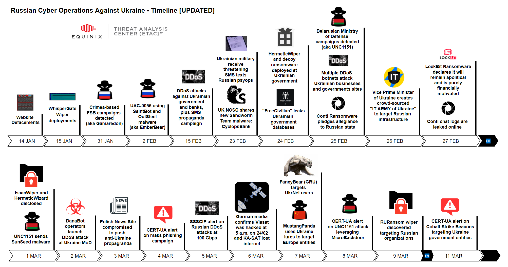

# Ukraine-Cyber-Operations
Curated Intelligence is working with analysts from around the world to provide useful information to organisations in Ukraine looking for additional free threat intelligence. Slava Ukraini. Glory to Ukraine. ([Blog](https://www.curatedintel.org/2021/08/welcome.html) | [Twitter](https://twitter.com/CuratedIntel) | [LinkedIn](https://www.linkedin.com/company/curatedintelligence/))

### `Resources`
  - Timeline of Threat Reports
    - [January Threat Reports](https://github.com/curated-intel/Ukraine-Cyber-Operations#january-threat-reports)
    - [February Threat Reports](https://github.com/curated-intel/Ukraine-Cyber-Operations#february-threat-reports)
    - [March Threat Reports](https://github.com/curated-intel/Ukraine-Cyber-Operations#march-threat-reports)
    - [April Threat Reports](https://github.com/curated-intel/Ukraine-Cyber-Operations#april-threat-reports)
  - [Vendor Support](https://github.com/curated-intel/Ukraine-Cyber-Operations#vendor-support) 
  - [Vetted OSINT Sources](https://github.com/curated-intel/Ukraine-Cyber-Operations#vetted-osint-sources) 
  - [Miscellaneous Resources](https://github.com/curated-intel/Ukraine-Cyber-Operations#miscellaneous-resources) 
  - Equinix Threat Analysis Center (ETAC) contributions:
    - Contextualized [Indicators of Compromise (IOCs)](https://github.com/curated-intel/Ukraine-Cyber-Operations/tree/main/ETAC_IOCs) by ETAC `(Last updated 25 March 2022)`
    - Contextualized CERT-UA IOCs - see [here](https://github.com/curated-intel/Ukraine-Cyber-Operations/blob/main/ETAC_IOCs/CERT-UA_IOCs.csv) `(Last updated 28 March 2022)`
    - Vetted [YARA rule collection](https://github.com/curated-intel/Ukraine-Cyber-Operations/tree/main/yara) by ETAC `(Last updated 4 April 2022)`
    - Graphic of a Timeline of Russia-Ukraine Cyberwar `(Last updated 14 March 2022`)
    - Graphic of a Map of Russia-Ukraine Cyberwar `(Last updated 3 March 2022 `)
  - KPMG-Egyde Contributions: 
    - Added loosely-vetted [IOC Threat Hunt Feeds](https://github.com/curated-intel/Ukraine-Cyber-Operations/tree/main/KPMG-Egyde_Ukraine-Crisis_Feeds/MISP-CSV_MediumConfidence_Filtered) (h/t [0xDISREL](https://twitter.com/0xDISREL)) `(Last updated 7 April 2022)`
    - IOCs shared by these feeds are `LOW-TO-MEDIUM CONFIDENCE` we strongly recommend NOT adding them to a blocklist
    - These could potentially be used for `THREAT HUNTING` and could be added to a `WATCHLIST`
    - IOCs are generated in `MISP COMPATIBLE` CSV format
    - Additional [Threat Hunt Feed](https://github.com/curated-intel/Ukraine-Cyber-Operations/blob/main/KPMG-Egyde_Ukraine-Crisis_Feeds/MISP-CSV_LowConfidence_Unfiltered/Ukraine-Crisis_DomainTools_ThreatHunt_Feed.csv) for recently registered Ukrainian domain names (h/t DomainTools)
    - Additional [Threat Hunt Feed](https://github.com/curated-intel/Ukraine-Cyber-Operations/blob/main/KPMG-Egyde_Ukraine-Crisis_Feeds/MISP-CSV_MediumConfidence_Filtered/Ukraine-Crisis_RecordedFuture_ThreatHunt_Feed.csv) for threat groups targeting Ukraine (h/t RecordedFuture)
    - Ukrainain organizations offered by [Access and Data Brokers](https://github.com/curated-intel/Ukraine-Cyber-Operations/blob/main/access_data_brokers.md) on underground forums

### `Graphics by ETAC`

#### `January Threat Reports`
| Date | Source | Threat(s) | URL |
| --- | --- | --- | --- |
| 14 JAN | SSU Ukraine | Website Defacements | [ssu.gov.ua](https://ssu.gov.ua/novyny/sbu-rozsliduie-prychetnist-rosiiskykh-spetssluzhb-do-sohodnishnoi-kiberataky-na-orhany-derzhavnoi-vlady-ukrainy)|
| 15 JAN | Microsoft | WhisperGate wiper (DEV-0586) | [microsoft.com](https://www.microsoft.com/security/blog/2022/01/15/destructive-malware-targeting-ukrainian-organizations/) |
| 19 JAN | Elastic | WhisperGate wiper (Operation BleedingBear) | [elastic.github.io](https://elastic.github.io/security-research/malware/2022/01/01.operation-bleeding-bear/article/) |
| 31 JAN | Symantec | Gamaredon/Shuckworm/PrimitiveBear (FSB) | [symantec-enterprise-blogs.security.com](https://symantec-enterprise-blogs.security.com/blogs/threat-intelligence/shuckworm-gamaredon-espionage-ukraine) |

#### `February Threat Reports`
| Date | Source | Threat(s) | URL |
| --- | --- | --- | --- |
| 2 FEB | RaidForums | Access broker "GodLevel" offering Ukrainain algricultural exchange | RaidForums [not linked] |
| 2 FEB | CERT-UA | UAC-0056 using SaintBot and OutSteel malware | [cert.gov.ua](https://cert.gov.ua/article/18419) |
| 3 FEB | PAN Unit42 | Gamaredon/Shuckworm/PrimitiveBear (FSB) | [unit42.paloaltonetworks.com](https://unit42.paloaltonetworks.com/gamaredon-primitive-bear-ukraine-update-2021/) |
| 4 FEB | Microsoft | Gamaredon/Shuckworm/PrimitiveBear (FSB) | [microsoft.com](https://www.microsoft.com/security/blog/2022/02/04/actinium-targets-ukrainian-organizations/) |
| 8 FEB | NSFOCUS | Lorec53 (aka UAC-0056, EmberBear, BleedingBear) | [nsfocusglobal.com](https://nsfocusglobal.com/apt-retrospection-lorec53-an-active-russian-hack-group-launched-phishing-attacks-against-georgian-government) |
| 15 FEB | CERT-UA | DDoS attacks against the name server of government websites as well as Oschadbank (State Savings Bank) & Privatbank (largest commercial bank). False SMS and e-mails to create panic | [cert.gov.ua](https://cert.gov.ua/article/37139) |
| 23 FEB | The Daily Beast | Ukrainian troops receive threatening SMS messages | [thedailybeast.com](https://www.thedailybeast.com/cyberattacks-hit-websites-and-psy-ops-sms-messages-targeting-ukrainians-ramp-up-as-russia-moves-into-ukraine) |
| 23 FEB | UK NCSC | Sandworm/VoodooBear (GRU) | [ncsc.gov.uk](https://www.ncsc.gov.uk/files/Joint-Sandworm-Advisory.pdf) |
| 23 FEB | SentinelLabs | HermeticWiper | [sentinelone.com]( https://www.sentinelone.com/labs/hermetic-wiper-ukraine-under-attack/ ) |
| 24 FEB | ESET | HermeticWiper | [welivesecurity.com](https://www.welivesecurity.com/2022/02/24/hermeticwiper-new-data-wiping-malware-hits-ukraine/) |
| 24 FEB | Symantec | HermeticWiper, PartyTicket ransomware, CVE-2021-1636, unknown webshell | [symantec-enterprise-blogs.security.com](https://symantec-enterprise-blogs.security.com/blogs/threat-intelligence/ukraine-wiper-malware-russia) |
| 24 FEB | Cisco Talos | HermeticWiper | [blog.talosintelligence.com](https://blog.talosintelligence.com/2022/02/threat-advisory-hermeticwiper.html) |
| 24 FEB | Zscaler | HermeticWiper | [zscaler.com](https://www.zscaler.com/blogs/security-research/hermetic-wiper-resurgence-targeted-attacks-ukraine) |
| 24 FEB | Cluster25 | HermeticWiper | [cluster25.io](https://cluster25.io/2022/02/24/ukraine-analysis-of-the-new-disk-wiping-malware/) |
| 24 FEB | CronUp | Data broker "FreeCivilian" offering multiple .gov.ua | [twitter.com/1ZRR4H](https://twitter.com/1ZRR4H/status/1496931721052311557)|
| 24 FEB | RaidForums | Data broker "Featherine" offering diia.gov.ua | RaidForums [not linked] |
| 24 FEB | DomainTools | Unknown scammers | [twitter.com/SecuritySnacks](https://twitter.com/SecuritySnacks/status/1496956492636905473?s=20&t=KCIX_1Ughc2Fs6Du-Av0Xw) |
| 25 FEB | @500mk500 | Gamaredon/Shuckworm/PrimitiveBear (FSB) | [twitter.com/500mk500](https://twitter.com/500mk500/status/1497339266329894920?s=20&t=opOtwpn82ztiFtwUbLkm9Q) |
| 25 FEB | @500mk500 | Gamaredon/Shuckworm/PrimitiveBear (FSB) | [twitter.com/500mk500](https://twitter.com/500mk500/status/1497208285472215042)|
| 25 FEB | Microsoft | HermeticWiper | [gist.github.com](https://gist.github.com/fr0gger/7882fde2b1b271f9e886a4a9b6fb6b7f) |
| 25 FEB | 360 NetLab | DDoS (Mirai, Gafgyt, IRCbot, Ripprbot, Moobot) | [blog.netlab.360.com](https://blog.netlab.360.com/some_details_of_the_ddos_attacks_targeting_ukraine_and_russia_in_recent_days/) |
| 25 FEB | Conti [themselves] | Conti ransomware, BazarLoader | Conti News .onion [not linked] |
| 25 FEB | CoomingProject [themselves] | Data Hostage Group | CoomingProject Telegram [not linked] |
| 25 FEB | CERT-UA | UNC1151/Ghostwriter (Belarus MoD) | [CERT-UA Facebook](https://facebook.com/story.php?story_fbid=312939130865352&id=100064478028712)|
| 25 FEB | Sekoia | UNC1151/Ghostwriter (Belarus MoD) | [twitter.com/sekoia_io](https://twitter.com/sekoia_io/status/1497239319295279106) |
| 25 FEB | @jaimeblascob | UNC1151/Ghostwriter (Belarus MoD) | [twitter.com/jaimeblasco](https://twitter.com/jaimeblascob/status/1497242668627370009)|
| 25 FEB | RISKIQ | UNC1151/Ghostwriter (Belarus MoD) | [community.riskiq.com](https://community.riskiq.com/article/e3a7ceea/) |
| 25 FEB | MalwareHunterTeam | Unknown phishing | [twitter.com/malwrhunterteam](https://twitter.com/malwrhunterteam/status/1497235270416097287) |
| 25 FEB | ESET | Unknown scammers | [twitter.com/ESETresearch](https://twitter.com/ESETresearch/status/1497194165561659394) |
| 25 FEB | BitDefender | Unknown scammers | [blog.bitdefender.com](https://blog.bitdefender.com/blog/hotforsecurity/cybercriminals-deploy-spam-campaign-as-tens-of-thousands-of-ukrainians-seek-refuge-in-neighboring-countries/) |
| 25 FEB | SSSCIP Ukraine | Unkown phishing | [twitter.com/dsszzi](https://twitter.com/dsszzi/status/1497103078029291522) |
| 25 FEB | RaidForums | Data broker "NetSec"  offering FSB (likely SMTP accounts) | RaidForums [not linked] |
| 25 FEB | Zscaler | PartyTicket decoy ransomware | [zscaler.com](https://www.zscaler.com/blogs/security-research/technical-analysis-partyticket-ransomware) |
| 25 FEB | INCERT GIE | Cyclops Blink, HermeticWiper | [linkedin.com](https://www.linkedin.com/posts/activity-6902989337210740736-XohK) [Login Required] |
| 25 FEB | Proofpoint | UNC1151/Ghostwriter (Belarus MoD) | [twitter.com/threatinsight](https://twitter.com/threatinsight/status/1497355737844133895?s=20&t=Ubi0tb_XxGCbHLnUoQVp8w) |
| 25 FEB | @fr0gger_ | HermeticWiper capabilities Overview | [twitter.com/fr0gger_](https://twitter.com/fr0gger_/status/1497121876870832128?s=20&t=_296n0bPeUgdXleX02M9mg)
| 25 FEB | Netskope | HermeticWiper analysis | [netskope.com](https://www.netskope.com/pt/blog/netskope-threat-coverage-hermeticwiper) |
| 26 FEB | BBC Journalist | A fake Telegram account claiming to be President Zelensky is posting dubious messages | [twitter.com/shayan86](https://twitter.com/shayan86/status/1497485340738785283?s=21) |
| 26 FEB | CERT-UA | UNC1151/Ghostwriter (Belarus MoD) | [CERT_UA Facebook](https://facebook.com/story.php?story_fbid=313517477474184&id=100064478028712) |
| 26 FEB | MHT and TRMLabs | Unknown scammers, linked to ransomware | [twitter.com/joes_mcgill](https://twitter.com/joes_mcgill/status/1497609555856932864?s=20&t=KCIX_1Ughc2Fs6Du-Av0Xw) |
| 26 FEB | US CISA | WhisperGate wiper, HermeticWiper | [cisa.gov](https://www.cisa.gov/uscert/ncas/alerts/aa22-057a) |
| 26 FEB | Bloomberg | Destructive malware (possibly HermeticWiper) deployed at Ukrainian Ministry of Internal Affairs & data stolen from Ukrainian telecommunications networks | [bloomberg.com](https://www.bloomberg.com/news/articles/2022-02-26/hackers-destroyed-data-at-key-ukraine-agency-before-invasion?sref=ylv224K8) |
| 26 FEB | Vice Prime Minister of Ukraine | IT ARMY of Ukraine created to crowdsource offensive operations against Russian infrastructure | [twitter.com/FedorovMykhailo](https://twitter.com/FedorovMykhailo/status/1497642156076511233) |
| 26 FEB | Yoroi | HermeticWiper | [yoroi.company](https://yoroi.company/research/diskkill-hermeticwiper-a-disruptive-cyber-weapon-targeting-ukraines-critical-infrastructures) |
| 27 FEB | LockBit [themselves] | LockBit ransomware | LockBit .onion [not linked] | 
| 27 FEB | ALPHV [themselves] | ALPHV ransomware | vHUMINT [closed source] |
| 27 FEB | Mēris Botnet [themselves] | DDoS attacks | vHUMINT [closed source] |
| 27 FEB | Facebook/Meta | Russian state actor-run websites posing as independent news entities and created fake personas across social media platforms including Facebook, Instagram, Twitter, YouTube, Telegram and also Russian Odnoklassniki and VK | [about.fb.com](https://about.fb.com/news/2022/02/security-updates-ukraine/) |
| 28 FEB | Horizon News [themselves] | Leak of China's Censorship Order about Ukraine | [techarp.com](https://www-techarp-com.cdn.ampproject.org/c/s/www.techarp.com/internet/chinese-media-leaks-ukraine-censor/?amp=1)|
| 28 FEB | Microsoft | FoxBlade (aka HermeticWiper) | [blogs.microsoft.com](https://blogs.microsoft.com/on-the-issues/2022/02/28/ukraine-russia-digital-war-cyberattacks/?preview_id=65075) |
| 28 FEB | @heymingwei | Potential BGP hijacks attempts against Ukrainian Internet Names Center | [twitter.com/heymingwei](https://twitter.com/heymingwei/status/1498362715198263300?s=20&t=Ju31gTurYc8Aq_yZMbvbxg) |
| 28 FEB | @cyberknow20 | Stormous ransomware targets Ukraine Ministry of Foreign Affairs | [twitter.com/cyberknow20](https://twitter.com/cyberknow20/status/1498434090206314498?s=21) | 

#### `March Threat Reports`
| Date | Source | Threat(s) | URL |
| --- | --- | --- | --- |
| 1 MAR | ESET | IsaacWiper and HermeticWizard | [welivesecurity.com](https://www.welivesecurity.com/2022/03/01/isaacwiper-hermeticwizard-wiper-worm-targeting-ukraine/) |
| 1 MAR | Proofpoint | Ukrainian armed service member's email compromised and sent malspam containing the SunSeed malware (likely TA445/UNC1151/Ghostwriter) | [proofpoint.com](https://www.proofpoint.com/us/blog/threat-insight/asylum-ambuscade-state-actor-uses-compromised-private-ukrainian-military-emails) |
| 1 MAR | Elastic | HermeticWiper | [elastic.github.io](https://elastic.github.io/security-research/intelligence/2022/03/01.hermeticwiper-targets-ukraine/article/) |
| 1 MAR | CrowdStrike | PartyTicket (aka HermeticRansom), DriveSlayer (aka HermeticWiper) | [CrowdStrike](https://www.crowdstrike.com/blog/how-to-decrypt-the-partyticket-ransomware-targeting-ukraine/) |
| 2 MAR | Zscaler | DanaBot operators launch DDoS attacks against the Ukrainian Ministry of Defense | [zscaler.com](https://www.zscaler.com/blogs/security-research/danabot-launches-ddos-attack-against-ukrainian-ministry-defense) |
| 2 MAR | Infoblox | Ukrainian Support Fraud | [blogs.infoblox.com](https://blogs.infoblox.com/cyber-threat-intelligence/cyber-threat-advisory/cyber-threat-advisory-ukrainian-support-fraud/) |
| 2 MAR | Trellix | Digging into HermeticWiper | [trellix.com](https://www.trellix.com/en-us/about/newsroom/stories/threat-labs/digging-into-hermeticwiper.html) |
| 2 MAR | Port Swigger | Ukraine invasion: WordPress-hosted university websites hacked in ‘targeted attacks’ | [portswigger.net](https://portswigger.net/daily-swig/ukraine-invasion-wordpress-hosted-university-websites-hacked-in-targeted-attacks) |
| 3 MAR | @ShadowChasing1 | Gamaredon/Shuckworm/PrimitiveBear (FSB) | [twitter.com/ShadowChasing1](https://twitter.com/ShadowChasing1/status/1499361093059153921) |
| 3 MAR | @vxunderground | News website in Poland was reportedly compromised and the threat actor uploaded anti-Ukrainian propaganda | [twitter.com/vxunderground](https://twitter.com/vxunderground/status/1499374914758918151?s=20&t=jyy9Hnpzy-5P1gcx19bvIA) |
| 3 MAR | @kylaintheburgh | Russian botnet on Twitter is pushing "#istandwithputin" and "#istandwithrussia" propaganda (in English) | [twitter.com/kylaintheburgh](https://twitter.com/kylaintheburgh/status/1499350578371067906?s=21) |
| 3 MAR | @tracerspiff | UNC1151/Ghostwriter (Belarus MoD) | [twitter.com](https://twitter.com/tracerspiff/status/1499444876810854408?s=21) |
| 3 MAR | Trustwave | Gorenie Fundraising Email Scams | [trustwave.com](https://www.trustwave.com/en-us/resources/blogs/spiderlabs-blog/dark-web-insights-evolving-cyber-tactics-aim-to-impact-the-russia-ukraine-conflict/) 
| 3 MAR | Trend Micro | Prominent Cyber Attacks in Russia-Ukraine Conflict | [trendmicro.com](https://www.trendmicro.com/en_us/research/22/c/cyberattacks-are-prominent-in-the-russia-ukraine-conflict.html) |
| 3 MAR | U.S. DoT | Press Releases: Treasury Sanctions Russians Bankrolling Putin and Russia-Backed Influence Actors | [treasury.gov](https://home.treasury.gov/news/press-releases/jy0628) |
| 3 MAR | Microsoft MSTIC | DEV-0586 (aka WhisperGate), DEV-0665 (aka FoxBlade/HermeticWizard/HermeticWiper), SonicVote (aka HermeticRansom & PartyTicket), Lasainraw (aka IsaacWiper) | [twitter.com/MalwareRE](https://twitter.com/MalwareRE/status/1499209531670335498) |
| 4 MAR | Interfax | CERT-UA warns about mass mailings of malicious software | [interfax.com.ua](https://en.interfax.com.ua/news/general/807175.html) |
| 4 MAR | eln0ty | HermeticWiper/FoxBlade Analysis (in-depth) | [eln0ty.github.io](https://eln0ty.github.io/malware%20analysis/HermeticWiper/) |
| 4 MAR | Mandiant | Sandworm, UNC2589 (aka Lorec53/UAC-0056/EmberBear), UNC3715 (aka DEV-0665/HermeticWiper), and potentially TEMP.Isotope (aka BerserkBear/EnergeticBear/Dragonfly) | [mandiant.com](https://www.mandiant.com/resources/russia-invasion-ukraine-retaliation) |
| 5 MAR | SSSCIP Ukraine |  Russian DDos attacks (100 Gbps at their peak)  primarily aimed at the resources of Verkhovna Rada, Cabinet of Ministers, President of Ukraine, Defense Ministry and Internal Affairs Ministry | [twitter.com/dsszzi](https://twitter.com/dsszzi/status/1500090448735621128) |
| 6 MAR | @shakirov2036 | Notice Russian Government Websites To move to domestic hosting thread | [twitter.com/shakirov2036](https://twitter.com/shakirov2036/status/1500584933491982341) |
| 7 MAR | ReverseMode | SATCOM terminals under attack in Europe: plausible analysis | [reversemode.com](https://www.reversemode.com/2022/03/satcom-terminals-under-attack-in-europe.html) |
| 7 MAR | Google TAG | FancyBear (aka APT28) targeted users of UkrNet (a Ukrainian media company), Ghostwriter (aka UNC1151), Mustang Panda (aka Temp.Hex), DDoS attacks | [blog.google](https://blog.google/threat-analysis-group/update-threat-landscape-ukraine/) |
| 7 MAR | CERT-UA | UAC-0051 (aka UNC1151), MicroBackdoor, CVE-2019-0541 | [cert.gov.ua](https://cert.gov.ua/article/37626) |
| 8 MAR | Cluster25 | UNC1151/Ghostwriter (Belarus MoD) | [cluster25.io](https://cluster25.io/2022/03/08/ghostwriter-unc1151-adopts-microbackdoor-variants-in-cyber-operations-against-targets-in-ukraine/) |
| 8 MAR | Trend Micro | RURansom - a data wiper targeting Russian organizations | [trendmicro.com](https://www.trendmicro.com/en_us/research/22/c/new-ruransom-wiper-targets-russia.html) |
| 9 MAR | ReversingLabs | HermeticWiper and IsaacWiper | [blog.reversinglabs.com](https://blog.reversinglabs.com/blog/wiper-malware-targeting-ukraine-evidence-of-planning-and-haste) |
| 11 MAR | CERT-UA | UAC-0056 (aka Lorec53, EmberBear) push fake antivirus updates containing Cobalt Strike Beacons, GrimImplant, and GraphSteel malspam against state authorities of Ukraine | [cert.gov.ua](https://cert.gov.ua/article/37704) |
| 11 MAR | Infosec Magazine | pro-Ukrainian actors should be wary of downloading DDoS tools to attack Russia, as they may be booby-trapped with info-stealing malware | [infosecurity-magazine.com](https://www.infosecurity-magazine.com/news/ukrainian-it-army-hijacked-malware/) |
| 11 MAR | @cyberknow20 | "Xahnet" shared a video they allegedly left a message and defaced the main page of Ukraine's capital bank [unvalidated] | [twitter.com/cyberknow20](https://twitter.com/cyberknow20/status/1502166591466659840?s=21) |
| 13 MAR | Spiegel | German Anonymous hacktivists target Rosneft Germany, allegedly stole 20TB of data, deleted 59 Apple devices remotely, and left "Slava Ukraini" on wiped systems | [spiegel.de](https://www.spiegel.de/netzwelt/web/bundeskriminalamt-ermittelt-hackerangriff-auf-rosneft-deutschland-a-74e3a53a-e747-4500-8198-ea6780a7d79a) |
| 13 MAR | BeeHive | Twitter user "BeeHive" allegedly exploited a vulnerability in the open-source ADS-B radar reporting feeds and digital transponders to manipulate Russian airlines, causing Aeroflot planes to erroneously squawk "7700" (for emergencies) and display anti-Russian callsigns on flight radars | [twitter.com/BeeHiveCyberSec](https://twitter.com/BeeHiveCyberSec/status/1503079608639320072?s=20&t=LDtQhFLUO3qAckLA1ryKmQ) |
| 14 MAR | Cisco Talos | Opportunistic cybercriminals take advantage of Ukraine invasion | [blog.talosintelligence.com](https://blog.talosintelligence.com/2022/03/ukraine-invasion-scams-malware.html?m=1) |
| 14 MAR | ESET | Another wiper was discovered targeting Ukraine, dubbed CaddyWiper, which was delivered via GPO, indicating the adversary had prior control of the target's network beforehand. CaddyWiper is seeminginly not connected to other the wipers targeting Ukraine, including Whispergate, HermeticWiper, or IsaacWiper | [twitter.com/ESETresearch](https://twitter.com/ESETresearch/status/1503436420886712321) |
| 15 MAR | VICE | The Security Service of Ukraine (SBU) detained a “hacker” who provided assistance to Russian troops in Ukraine by routing phone calls on their behalf, and sent text messages to Ukrainian security forces suggesting they surrender | [vice.com](https://www.vice.com/en/article/v7djda/ukraine-arrests-hacker-routing-calls-for-russian-troops) |
| 15 MAR | SentinelOne | Threat Actor UAC-0056 Targeting Ukraine with Fake Translation Software | [sentinelone.com/blog](https://www.sentinelone.com/blog/threat-actor-uac-0056-targeting-ukraine-with-fake-translation-software/) |
| 16 MAR | CERT-UA | QR code phishing posing as UKR.NET linked to UAC-0028 group (APT28/FancyBear/GRU) | [cert.gov.ua](https://cert.gov.ua/article/37788) |
| 17 MAR | CERT-UA | UAC-0020 (Vermin) cyberattack on Ukrainian state organizations using the SPECTR malware, whose activities are associated with the so-called security agencies of the so-called "Luhansk People's Republic" | [cert.gov.ua](https://cert.gov.ua/article/37815) |
| 18 MAR | CERT-UA | UAC-0035 (InvisiMole) cyberattack on State Organizations of Ukraine | [cert.gov.ua](https://cert.gov.ua/article/37829) |
| 22 MAR | CERT-UA | UAC-0088 deploys DoubleZero wiper | [cert.gov.ua](https://cert.gov.ua/article/38088) |
| 22 MAR | CERT-UA | UAC-0026 cyberattack using HeaderTip malware, linked to [Scarab APT](https://twitter.com/aRtAGGI/status/1506010831221248002) | [cert.gov.ua](https://cert.gov.ua/article/38097) |
| 23 MAR | Interfax UA | Datagroup, a provider of fiber-optic infrastructure and digital services, resolved more than 350 DDoS attacks on the country's telecommunications network during the month of the war. The largest attack was 103.6 Gbps, 28.0 Mpps; the most powerful attack was 27.6 Gbps, 43.0 Mpps; the longest attack was 24 days. | [interfax.com.ua](https://en.interfax.com.ua/news/telecom/817143.html) |
| 23 MAR | BalkanInsight | Croatian police are probing the hacking of the ‘Slobodna Dalmacija’ website, where hackers replaced content with pro-Russian articles on Ukraine. “Western Deception Machine”, “Which Side Are You On?”, and “The United States of America Admitted They Have Hidden Laboratories in Ukraine”, are just some of the fake articles that the hackers posted online. | [balkaninsight.com](https://balkaninsight.com/2022/03/23/hackers-attack-croatian-daily-post-kremlin-propaganda/) |
| 23 MAR | CERT-UA | UAC-0051 group (UNC1151/GhostWriter), Cobalt Strike Beacons | [cert.gov.ua](https://cert.gov.ua/article/38155) |
| 24 MAR | SentinelOne | Ukraine CERT (CERT-UA) has released new details on UAC-0026, which SentinelLabs confirms is associated with the suspected Chinese threat actor known as Scarab. Scarab has conducted a number of campaigns over the years, making use of a custom backdoor originally known as Scieron, which may be the predecessor to HeaderTip. | [sentinelone.com](https://www.sentinelone.com/labs/chinese-threat-actor-scarab-targeting-ukraine/) |
| 24 MAR | Lab52 | Quasar RAT spear-phishing campaign | [lab52.io](https://lab52.io/blog/another-cyber-espionage-campaign-in-the-russia-ukrainian-ongoing-cyber-attacks/) |
| 25 MAR | SSSCIP Ukraine | Who is behind the Cyberattacks on Ukraine's Critical Information Infrastructure: Statistics for March 15-22 | [cip.gov.ua](https://cip.gov.ua/en/news/khto-stoyit-za-kiberatakami-na-ukrayinsku-kritichnu-informaciinu-infrastrukturu-statistika-15-22-bereznya) |
| 25 MAR | SSSCIP Ukraine | Statistics of Cyber Attacks on Ukrainian Critical Information Infrastructure: 15-22 March | [cip.gov.ua](https://cip.gov.ua/en/news/statistika-kiberatak-na-ukrayinsku-kritichnu-informaciinu-infrastrukturu-15-22-bereznya) |
| 26 MAR | @_n0p_ | Analysis of a Caddy Wiper Sample | [n0p.me](https://n0p.me/2022/03/2022-03-26-caddywiper/) |
| 28 MAR | CERT-UA | Cyberattack on Ukrainian state authorities using pseudoSteel malware linked to UAC-0010 (Armageddon/Gamaredon) | [cert.gov.ua](https://cert.gov.ua/article/38371) |
| 28 MAR | Cyber, etc | Ukraine's largest fix-line telecommunications operator hit by cyber attack | [Cyber, etc](https://twitter.com/cyber_etc/status/1508498145831010315) |
| 28 MAR | SSSCIP Ukraine | Cyberattack against Ukrtelecom IT-infrastructure and recovery | [twitter.com/ dsszzi](https://twitter.com/dsszzi/status/1508528209075257347) |
| 28 MAR | CERT-UA | GraphSteel and GrimPlant, UAC-0056 | [cert.gov.ua](https://cert.gov.ua/article/38374) |
| 29 MAR | Newsweek | U.S. Airport hit with Cyberattack over Ukraine | [Newsweek](https://www.newsweek.com/us-airport-hit-cyberattack-over-ukraine-no-one-afraid-you-1692903) |
| 29 MAR | ZDnet | The Security Service of Ukraine (SBU) has destroyed five "enemy" bot farms engaged in activities to frighten Ukrainian citizens. In a March 28 release, the SBU said that the bot farms had an overall capacity of at least 100,000 accounts spreading misinformation and fake news surrounding Russia's invasion of Ukraine | [zdnet.com](https://www.zdnet.com/article/ukraine-takes-out-five-bot-farms-spreading-panic-among-citizens/) |
| 30 MAR | Viasat | Viasat is providing an overview and incident report on the cyber-attack against the KA-SAT network, which occurred on 24 February 2022, and resulted in a partial interruption of KA-SAT's consumer-oriented satellite broadband service. | [viasat.com](https://www.viasat.com/about/newsroom/blog/ka-sat-network-cyber-attack-overview/) |
| 30 MAR | CrowdStrike | EMBER BEAR (aka UAC-0056, Lorec53, Lorec Bear, Bleeding Bear, Saint Bear) | [crowdstrike.com](https://www.crowdstrike.com/blog/who-is-ember-bear/) |
| 30 MAR | CERT-UA | MarsStealer, UAC-0041 | [cert.gov.ua](https://cert.gov.ua/article/38606) |
| 30 MAR | Google TAG | Curious Gorge (APT from China), COLDRIVER (APT from Russia), Ghostwriter (APT from Belarus) | [blog.google](https://blog.google/threat-analysis-group/tracking-cyber-activity-eastern-europe/) |
| 30 MAR | Viasat | KA-SAT Network cyber attack overview | [viasat.com](https://www.viasat.com/about/newsroom/blog/ka-sat-network-cyber-attack-overview/) |
| 30 MAR | InQuest | CloudAtlas APT group linked to a maldoc impersonating the United States Securities and Exchange Commission | [inquest.net](https://inquest.net/blog/2022/03/30/cloud-atlas-maldoc) |
| 31 MAR | ReverseMode | VIASAT incident: from speculation to technical details | [reversemode.com](https://www.reversemode.com/2022/03/viasat-incident-from-speculation-to.html) |
| 31 MAR | SentinelLabs | [AcidRain](https://bazaar.abuse.ch/sample/9b4dfaca873961174ba935fddaf696145afe7bbf5734509f95feb54f3584fd9a/) IoT Wiper (ELF MIPS), connected to the [VPNFilter](https://bazaar.abuse.ch/sample/47f521bd6be19f823bfd3a72d851d6f3440a6c4cc3d940190bdc9b6dd53a83d6/) stage 3 destructive plugin | [sentinelone.com](https://www.sentinelone.com/labs/acidrain-a-modem-wiper-rains-down-on-europe/) |

#### `April Threat Reports`
| Date | Source | Threat(s) | URL |
| --- | --- | --- | --- |
| 1 APR | Malwarebytes | UAC-0056 (aka SaintBear, UNC2589 and TA471) is a cyber espionage actor that has been active since early 2021 and has mainly targeted Ukraine and Georgia | [blog.malwarebytes.com](https://blog.malwarebytes.com/threat-intelligence/2022/04/new-uac-0056-activity-theres-a-go-elephant-in-the-room/) |
| 2 APR | Ukraine SBU | According to preliminary data, the organization of cyber sabotage was carried out by the Russian special services, and specialized hacker groups APT28, ART29, Sandworm, BerserkBear, Gamaredon, Vermin, etc. were implemented. | [t.me/SBUkr](https://t.me/SBUkr/4043) |
| 3 APR | me | Low-detect BlackGuard infostealer uploaded to AnyRun from Ukraine | [twitter.com/BushidoToken](https://twitter.com/BushidoToken/status/1510619652946378754) |
| 4 APR | CERT-UA | UAC-0010 (Armageddon) cyberattack on Ukrainian state organizations, phishing w/ RAR -> HTA -> VBS | [cert.gov.ua](https://cert.gov.ua/article/39138) |
| 4 APR | CERT-UA | UAC-0010 (Armageddon) cyberattack on state institutions of the European Union countries, phishing w/ RAR -> LNK | [cert.gov.ua](https://cert.gov.ua/article/39086) |
| 5 APR | CERT-UA | UAC-0094 targets Telegram users via SMS phishing, stealing session data, the list of contacts and conversation history | [cert.gov.ua](https://cert.gov.ua/article/39253) |
| 5 APR | @h2jazi | RedlineStealer is taking advantage of War in Ukraine | [twitter.com/h2jazi](https://twitter.com/h2jazi/status/1511473962315919362?s=21&t=4UqYDl6bWvvNPPS9NG4TOQ) |
| 6 APR | US Department of Justice | DOJ Operation that Copied and Removed Malware Known as “Cyclops Blink” from the Botnet’s Command-And-Control Devices, Disrupting the GRU’s Control Over Thousands of Infected Devices Worldwide. | [justice.gov](https://www.justice.gov/opa/pr/justice-department-announces-court-authorized-disruption-botnet-controlled-russian-federation) |
| 6 APR | @youranontv | "BlackRabbit" who operates in behalf of Anonymous #OpRussia gained access to the Kremlin CCTV system | [twitter.com/youranontv](https://twitter.com/youranontv/status/1511656225687154688) |
| 7 APR | @iiyonite | IT ARMY of Ukraine breached a database of Rossgram beta sign-ups (Russian Instagram clone), then created a fake Rossgram app, send invites to said beta users, then pushed notifications out to those users that Rossgram was hacked and then leaked the data of the beta users | [twitter.com/iiyonite](https://twitter.com/iiyonite/status/1512001395255357443) |
| 7 APR | @h2jazi | CloudAtlas APT maldoc: "Composition_of_the_State_Defense_Committee_of_Donetsk_People_Republic.doc" | [twitter.com/h2jazi](https://twitter.com/h2jazi/status/1512076989556961286?s=21&t=zdqFNbXN9GnKZiKQNp-UqQ) |
| 7 APR | Facebook/Meta | Government-linked actors from Russia and Belarus engaged in cyber espionage and covert influence operations online. This activity included interest in the Ukrainian telecom industry; both global and Ukrainian defense and energy sectors; tech platforms; and journalists and activists in Ukraine, Russia, and abroad | [about.fb.com](https://about.fb.com/wp-content/uploads/2022/04/Meta-Quarterly-Adversarial-Threat-Report_Q1-2022.pdf) |
| 8 APR | Microsoft | Microsoft took down Strontium domains using this infrastructure for [phishing](https://twitter.com/dacuddy/status/1512193359602888725) to target Ukrainian institutions including media organizations. It was also targeting government institutions and think tanks in the United States and the European Union involved in foreign policy | [blogs.microsoft.com](https://blogs.microsoft.com/on-the-issues/2022/04/07/cyberattacks-ukraine-strontium-russia/) |
| 8 APR | MFA Finland | Russia accused of disruptions in the Foreign Ministry's online services: Um[.]fi and Finlanabroad[.]fi sites were targeted by DDoS | [twitter.com/Ulkoministerio](https://twitter.com/Ulkoministerio/status/1512368322012233731?s=20&t=Eh6rnggBh4Zvn8la45AL5Q) |
| 12 APR | CERT-UA | Sandworm launched Industroyer2 and CaddyWiper against Ukrainian Electrical Energy Facilities | [cert.gov.ua](https://cert.gov.ua/article/39518) |
| 12 APR | ESET | Sandworm's attack used an ICS-capable malware and regular disk wipers for Windows, Linux and Solaris operating systems | [welivesecurity.com](https://www.welivesecurity.com/2022/04/12/industroyer2-industroyer-reloaded/) |
| 14 APR | CERT-UA | UAC-0097 Cyberattack on Ukrainian state organizations using XSS exploit vulnerability in Zimbra Collaboration Suite (CVE-2018-6882) | [cert.gov.ua](https://cert.gov.ua/article/39606) |
| 14 APR | CERT-UA | UAC-0098 Cyberattack on Ukrainian state organizations using icedID malware | [cert.gov.ua](https://cert.gov.ua/article/39609) |
| 18 APR | CERT-UA | UAC-0098 Cyberattack on Ukrainian state organizations using the Azovstal theme and the Cobalt Strike Beacon | [cert.gov.ua](https://cert.gov.ua/article/39708) |
| 19 APR | CERT-UA | Online fraud using the subject of "financial assistance from EU countries" | [cert.gov.ua](https://cert.gov.ua/article/39727) |
| 20 APR | Symantec | Shuckworm/Gamaredon/UAC-0010: Espionage Group Continues Intense Campaign Against Ukraine | [symantec.com](https://symantec-enterprise-blogs.security.com/blogs/threat-intelligence/shuckworm-intense-campaign-ukraine) |
| 20 APR | TheRecord | Interview with Natalia Tkachuk, head of the Information Security and Cybersecurity Service — part of the National Security and Defense Council of Ukraine | [therecord.media](https://therecord.media/from-the-front-lines-of-the-first-real-cyberwar/) |
| 22 APR | SSSCIP Ukraine | UAC-0010 (aka Armageddon), UAC-0051 (aka UNC1151), UAC-0028 (aka APT28) are the top three groups that have waged the most number of cyberattacks on Ukrainian infrastructure | [twitter.com/dsszzi](https://twitter.com/dsszzi/status/1517553942678446082?s=21&t=B45Ox-B9amKu9jTt0BT8Zw) |
| 23 APR | SSSCIP Ukraine | Details about Sandworm attacks against the Ukrainian electricity sector | [twitter.com/dsszzi](https://twitter.com/dsszzi/status/1517806362495012865) |

#### `Vendor Support`
| Vendor | Offering | URL |
| --- | --- | --- |
| Dragos | Access to Dragos service if from US/UK/ANZ and in need of ICS cybersecurity support | [twitter.com/RobertMLee](https://twitter.com/RobertMLee/status/1496862093588455429) |
| GreyNoise |  Any and all `Ukrainian` emails registered to GreyNoise have been upgraded to VIP which includes full, uncapped enterprise access to all GreyNoise products. There is a landing page for GreyNoise data at [https://www.greynoise.io/viz/pulse](https://www.greynoise.io/viz/pulse) | [twitter.com/Andrew___Morris](https://twitter.com/Andrew___Morris/status/1496923545712091139) |
| Recorded Future | Providing free intelligence-driven insights, perspectives, and mitigation strategies as the situation in Ukraine evolves| [recordedfuture.com](https://www.recordedfuture.com/ukraine/) |
| Flashpoint | Free Access to Flashpoint’s Latest Threat Intel on Ukraine | [go.flashpoint-intel.com](https://go.flashpoint-intel.com/trial/access/30days) |
| ThreatABLE | A Ukraine tag for free threat intelligence feed that's more highly curated to cyber| [twitter.com/threatable](https://twitter.com/threatable/status/1497233721803644950) |
| Orange | IOCs related to Russia-Ukraine 2022 conflict extracted from our Datalake Threat Intelligence platform. | [github.com/Orange-Cyberdefense](https://github.com/Orange-Cyberdefense/russia-ukraine_IOCs)|
| FSecure | F-Secure FREEDOME VPN is now available for free in all of Ukraine | [twitter.com/FSecure](https://twitter.com/FSecure/status/1497248407303462960) |
| Multiple vendors | List of vendors offering their services to Ukraine for free, put together by [@chrisculling](https://twitter.com/chrisculling/status/1497023038323404803) | [docs.google.com/spreadsheets](https://docs.google.com/spreadsheets/d/18WYY9p1_DLwB6dnXoiiOAoWYD8X0voXtoDl_ZQzjzUQ/edit#gid=0) |
| Mandiant | Free threat intelligence, webinar and guidance for defensive measures relevant to the situation in Ukraine. | [mandiant.com](https://www.mandiant.com/resources/insights/ukraine-crisis-resource-center) |
| Starlink | Satellite internet constellation operated by SpaceX providing satellite Internet access coverage to Ukraine | [twitter.com/elonmusk](https://twitter.com/elonmusk/status/1497701484003213317) |
| Romania DNSC | Romania’s DNSC – in partnership with Bitdefender – will provide technical consulting, threat intelligence and, free of charge, cybersecurity technology to any business, government institution or private citizen of Ukraine for as long as it is necessary. | [Romania's DNSC Press Release](https://dnsc.ro/citeste/press-release-dnsc-and-bitdefender-work-together-in-support-of-ukraine)|
| BitDefender | Access to Bitdefender technical consulting, threat intelligence and both consumer and enterprise cybersecurity technology | [bitdefender.com/ukraine/](https://www.bitdefender.com/ukraine/) |
| NameCheap | Free anonymous hosting and domain name registration to any anti-Putin anti-regime and protest websites for anyone located within Russia and Belarus | [twitter.com/Namecheap](https://twitter.com/Namecheap/status/1498998414020861953) |
| Avast | Free decryptor for PartyTicket ransomware | [decoded.avast.io](https://decoded.avast.io/threatresearch/help-for-ukraine-free-decryptor-for-hermeticransom-ransomware/) |
| Recorded Future | Insikt Group’s list of indicators of compromise associated with threat actors and malware related to the Russian cyber actions against Ukraine | [recordedfuture.com](https://www.recordedfuture.com/ukraine/) |
| CybelAngel | CybelAngel offers its services to interested NGOs active in the war at no cost, to minimize the risks of their missions being interrupted by cyber attacks. CybelAngel also offers Ukrainian companies an assessment of their digital exposure in the region at no charge. | [cybelangel.com](https://cybelangel.com/blog/message-on-ukraine/) |
| Malware Patrol | Free 6 months DNS Firewall service subscription for Ukraine-based companies and goverment entities | [www.linkedin.com](https://www.linkedin.com/feed/update/urn:li:activity:6903059206522712064/) |
| UnderDefense | UnderDefense is providing Managed Detection & Response services and incident repsonse support for Ukrainian critical infrastructure & government consulting in cybersecurity | [underdefense.com](https://underdefense.com/) |

#### `Vetted OSINT Sources`
| Handle | Affiliation |
| --- | --- |
| [@KyivIndependent](https://twitter.com/KyivIndependent) | English-language journalism in Ukraine |
| [@IAPonomarenko](https://twitter.com/IAPonomarenko) | Defense reporter with The Kyiv Independent |
| [@KyivPost](https://twitter.com/KyivPost) | English-language journalism in Ukraine |
| [@Shayan86](https://twitter.com/Shayan86) | BBC World News Disinformation journalist |
| [@Liveuamap](https://twitter.com/Liveuamap) | Live Universal Awareness Map (“Liveuamap”) independent global news and information site |
| [@DAlperovitch](https://twitter.com/DAlperovitch) | The Alperovitch Institute for Cybersecurity Studies, Founder & Former CTO of CrowdStrike |
| [@COUPSURE](https://twitter.com/COUPSURE) | OSINT investigator for Centre for Information Resilience |
| [@netblocks](https://twitter.com/netblocks) | London-based Internet's Observatory |

#### `Miscellaneous Resources`
| Source | URL | Content |
| --- | --- | --- |
| PowerOutages.com | https://poweroutage.com/ua | Tracking PowerOutages across Ukraine |
| Monash IP Observatory | https://twitter.com/IP_Observatory | Tracking IP address outages across Ukraine |
| Project Owl Discord | https://discord.com/invite/projectowl | Tracking foreign policy, geopolitical events, military and governments, using a Discord-based crowdsourced approach, with a current emphasis on Ukraine and Russia |
| russianwarchatter.info | https://www.russianwarchatter.info/ | Known Russian Military Radio Frequencies |
| UT CREEES | https://liberalarts.utexas.edu/slavic/resources/ukraine-conflict-resources.php | Compiled resources to help understand the Russian invasion of Ukraine, with links to resources, action items, and academic sources |
| Telegram | https://t.me/s/itarmyofukraine2022 | IT ARMY of Ukraine |
| Telegram | https://t.me/s/cert_ua | Computer Emergency Response Team (CERT) of Ukraine |
| Telegram | https://t.me/SBUkr | Security Service of Ukraine (SBU) |

### Note:

Curated Intel `does not` support, encourage, partake, or condone hacking, attacking or targeting users of any kind. This information is `clearly` meant to `help` cybersecurity teams `supporting Ukraine` still doing their jobs while dealing with the Russian invasion.
